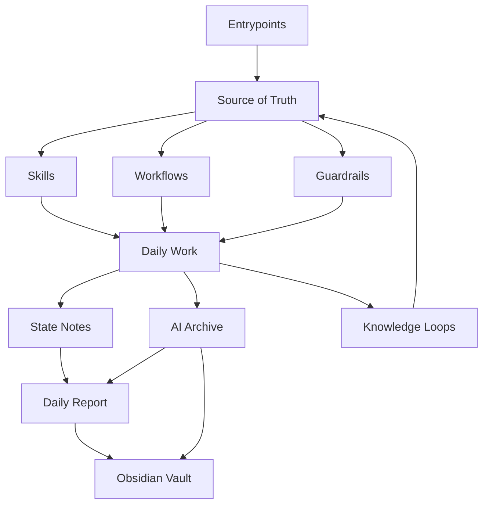

# AI Ops Showcase

このフォルダは、自分のワークスペースで育ててきた **AI 実務運用の設計** を、個人情報や濃い人格設定を取り除いた形で見せるための成果物です。

`AI に質問する` だけでなく、`ログを残す` `状態を引き継ぐ` `入口をそろえる` `壊れやすいところを点検する` `自作 Skill と workflow で繰り返し作業を定型化する` まで含めて運用していることを、Web 制作が分かる人にも読める形へ翻訳しています。

## 20秒でいうと
この repo は、AIそのものを開発する資料ではなく、
AIを仕事で安定して使うための「入口設計」「記録」「状態管理」「日報化」「引き継ぎ」「点検」の仕組みを見せる展示です。

主題:
- AIとの会話を記録として残す
- 記録を state / report / handoff につなぐ
- 入口と正本を分けて drift を防ぐ
- 自動化の責務を capture / state / report / sync に分ける
- check:workspace で崩れを早く見つける

非主題:
- モデル監視
- 推論サーバ運用
- デプロイ自動化
- ロールバック
## AI に見せるなら

このフォルダや Git の URL を `ChatGPT` `Copilot` `Claude` などの AI に渡して、説明や要約の補助に使って大丈夫です。（`Gemini` はリポジトリの読み取りに未対応のようです……）


```text

https://github.com/aiuex0000/ai_ops_showcase
次の順番で対応してください。

1. まず README.md を読んでください。
2. 読めたファイル名を最初に列挙してください。
3. その後、このリポジトリが何を工夫している資料かを、AI運用に詳しくない人向けにやさしく説明してください。
4. 仕事でどう役立つかを中心に書いてください。
5. 推測は禁止です。読めなかった場合は「ファイルを取得できなかったため要約不能」とだけ答えてください。
6. 「AIの健康診断」「モデル劣化監視」「安全なデプロイ」「ロールバック」の話は、この repo に明記されている場合だけ触れてください。
7. 説明の最後に、根拠として参照したファイル名を3〜5個挙げてください。
```
## この文面について

この showcase の整理、構成づくり、文面化にも **Codex（GPT）** を使っています。  
ただし、元になっているのは実際に回している repo 運用で、内容は人間が見直しながら整えています。AI に丸投げした紹介文ではなく、**運用の実態を AI と一緒に再編集した資料** です。

## 一目で分かる構成

| レイヤー | 役割 | この showcase で見せるもの |
| --- | --- | --- |
| Entrypoints | AI をどこから起動して何を読ませるかを決める | `AGENTS.sample.md` / `copilot_instructions.sample.md` |
| Source of Truth | 長文ルール、メモリ、定型手順の正本 | `operating_model.md` / `workspace_manifest.sample.md` |
| Skills / Workflows | 反復作業を再利用可能な単位へ切り分ける | `skills_index.sample.md` / `daily_report_workflow.sample.md` |
| State / Archive | 現在地の保持と、後から戻れる記録層 | `current_state.sample.md` / `daily_report_workflow.sample.md` |
| Guardrails | 壊れやすいポイントの点検 | `check_workspace_harness.sample.ps1` |
| Knowledge Loops | 失敗パターンや確認済み事実をテーマ別に蓄積する | `operating_model.md` |
| Obsidian Integration | AI ログ・日報を Vault へ自動書き出しする | `archive_to_report_flow.md` / `daily_report_workflow.sample.md` |



## 読み方の導線

| 読む人 | おすすめの入口 |
| --- | --- |
| まず人間がざっくり理解したい | この `README.md` → [operating_model.md](./operating_model.md) |
| 用語から詰まる | [glossary.md](./glossary.md) |
| 運用の進化や比較から見たい | [check_script_evolution.md](./check_script_evolution.md) / [archive_to_report_flow.md](./archive_to_report_flow.md) |
| sample を先に見たい | `samples/` 配下 |

## これは何か

この展示は、生の repo コピーではありません。

- 元の運用から考え方を抜き出した解説
- 公開向けに再編集した sample
- どこを残し、どこを削ったかの方針

をまとめた **curated sample pack** です。

同時に、単なる見本集でもありません。実際に運用していく中で、

- 入口が太って drift しやすくなる
- 会話ログが日報や引き継ぎにうまくつながらない
- 自作 Skill と generic skill の役割が混ざる
- state note が長文化して読みづらくなる
- check script が増えて何を見ているか分かりにくくなる

といった問題を、その都度手入れしながら整えてきた記録でもあります。

## どんな課題を解決するか

AI を日常的に使うと、次のような問題が起きやすくなります。

- 会話や判断の履歴が散らばって、後から見返しづらい
- 毎回同じ前提説明をやり直して、再開コストが高い
- ツールごとに参照先が違い、入口が増えるほどブレやすい
- 便利な automation が増えるほど、何が正本か分かりにくくなる
- その場の会話は便利でも、作業フローとしては再現しにくい

このフォルダでは、それらに対して

- 入口を薄く保つ
- 正本レイヤーを分ける
- state note で現在地を短く持つ
- AI archive で会話を後追いできるようにする
- guardrail script で環境の崩れを早めに見つける

という設計をどう組むかを見せています。

要するに、`AI を便利に使う` から一歩進めて、**AI を再開しやすい作業環境の一部にするにはどうするか** を見せる資料です。

## 運用の全体像

全体像は [operating_model.md](./operating_model.md) にまとめています。ここでは次の 7 レイヤーで説明します。

- `entrypoints`: モデルやツールごとの薄い入口
- `source-of-truth`: 長文ルールや運用の正本
- `skills`: よく使う作業の再利用レイヤー
- `workflows`: 繰り返し手順の定型化
- `state stack`: 現在地と流れの保持
- `archive`: 会話や作業ログの保存
- `guardrails`: 壊れやすいポイントの点検

また、抽象論だけでなく、実際の repo では

- `.agent/.rules`
- `.agent/luna_memory`
- `.agent/skills`
- `.agent/workflows`
- `.agents/`
- `scripts/`

のように責務を分けて置いています。この showcase でも、その実在構造が伝わるように sample と構成図を寄せています。

## 実運用で育ったポイント

この展示で見せている内容は、最初からきれいに設計していたものではありません。使い続ける中で、次のような調整を重ねて今の形になっています。

| ぶつかった問題 | 調整した方針 |
| --- | --- |
| 入口ファイルに説明を書きすぎて drift する | 入口は薄くし、正本参照に寄せる |
| 会話ログは残るが、仕事の記録へつながらない | archive → state → report の流れを持たせる |
| 自作 Skill が増えて、何が repo 固有か分かりにくい | `repo-specific` と `generic` に分けて index 化する |
| automation が増えて責務が曖昧になる | capture layer / state layer / report layer を分ける |
| 環境が崩れても気づくのが遅い | `check:workspace` 系の一括 guardrail を用意する |

関連する補足資料:

- [check_script_evolution.md](./check_script_evolution.md): `check:workspace` を正式入口に寄せた理由
- [archive_to_report_flow.md](./archive_to_report_flow.md): `archive -> state -> report -> handoff` の接続例
- [samples/automation_matrix.sample.md](./samples/automation_matrix.sample.md): automation を責務別に分けた公開向け matrix

## 含めた sample 一覧

- [samples/AGENTS.sample.md](./samples/AGENTS.sample.md): AI 向け入口設計の例
- [samples/workspace_manifest.sample.md](./samples/workspace_manifest.sample.md): 正本と runtime surface の分離例
- [samples/copilot_instructions.sample.md](./samples/copilot_instructions.sample.md): モデル別入口の薄いルール例
- [samples/current_state.sample.md](./samples/current_state.sample.md): state note の最小例
- [samples/daily_report_workflow.sample.md](./samples/daily_report_workflow.sample.md): ログ回収から日報生成までの流れ
- [samples/check_workspace_harness.sample.ps1](./samples/check_workspace_harness.sample.ps1): 環境点検スクリプトの短い例
- [samples/skills_index.sample.md](./samples/skills_index.sample.md): repo-specific skill と generic skill の使い分け
- [samples/automation_matrix.sample.md](./samples/automation_matrix.sample.md): capture / state / report / sync を分けた automation 一覧

## 専用エージェント運用の利点

ここでいう `専用エージェント` は、単なるキャラクター遊びではありません。役割、口調、参照先、禁止事項、読み順を固定した AI の運用単位です。

利点は次のとおりです。

- どの入口から起動しても、読むべき正本へ戻しやすい
- 返答の温度や粒度をそろえやすく、引き継ぎ精度が上がる
- `この作業では何を読むか` を入口から制御できる
- Skill と workflow を役割別に切り分けやすい
- 日報、state 更新、runtime 調整、archive 管理のような反復作業を自作 Skill へ落とし込みやすい
- ログ運用や state note と組み合わせると、セッション再開が安定する

ここで重要なのは、`専用エージェント = キャラを付けること` ではない点です。実務的には、

- 何を先に読むか
- どこまでを入口に置くか
- どの作業を Skill にするか
- どこから先を workflow にするか
- どのレイヤーを automation に任せるか

を固定するための設計単位として効いています。

## この構成をどこまで一般利用できるか

この構成は、特定の IDE や 1 つの AI 製品に限定されません。`薄い入口` `正本` `state note` `archive` `guardrail` の 5 点セットは、個人運用でも小さなチーム運用でも再利用しやすい考え方です。

そのままコピペして完成するものではありませんが、

- 自分の AI 運用を整理したい
- 会話ログを仕事の記録へつなげたい
- 入口やルールが増えて散らかってきた
- AI の使い方をポートフォリオ向けに説明したい

という場面では、十分に土台として使えます。

# ai_ops_showcase
