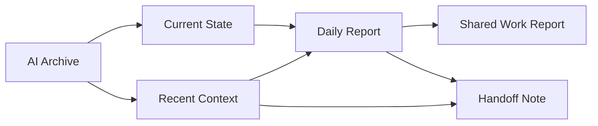

# Archive to Report Flow

このメモは、`AI archive を残すだけでは足りない` 理由と、`archive -> state -> report -> handoff` をどうつなぐかを公開向けに整理したものです。

## Why Archive Is Not Enough

会話ログや AI 出力を保存するだけだと、後から戻れる根拠は残ります。  
ただし、それだけでは日常運用で次の問題が残ります。

- 量はあるのに、今どこを見るべきかが分からない
- 重要な判断と雑談が同じ重さで並ぶ
- 日報や引き継ぎに落とす時、毎回 raw log を読み直す必要が出る
- `今の状態` と `今日の成果` が混ざる

そのため、この repo では archive をそのまま live state にせず、**state と report の間に圧縮レイヤーを置く** 方針を取っています。

## Archive to State to Report Flow

この流れで見ると、各層の役割は次のように分かれます。

- `AI Archive`
  - 会話や判断の根拠を後から辿る戻り先
- `Current State`
  - 今どこにいて、次に何を見るかの短い現在地
- `Recent Context`
  - 直近の流れや方針転換を圧縮した上位要約
- `Daily Report`
  - その日の作業を再圧縮した自分用成果物
- `Shared Work Report`
  - private な温度や jargon を落とした共有向け成果物
- `Handoff Note`
  - 次回起動や別環境で最初に見るべき点だけを抜く短い橋渡し

## Example Scenario

1. その日の会話や作業を `Obsidian/AI/` に raw log として保存する
2. `scripts/get-current-state-materials.ps1` で、同日の Codex / Copilot / archive / workspace signals を集める
3. 重要なシグナルだけ `Current State` や `Recent Context` に圧縮する
4. `scripts/collect-daily-report-materials.ps1` で、updated files / raw conversation sources / AI archive / office report sources をまとめる
5. その材料から `Daily Report` を作る
6. 必要に応じて `Shared Work Report` や `Handoff Note` へ再圧縮する

このとき、archive は `参照元` であり、state や report の置き換えではありません。

## What We Learned In Practice

- archive を live state の代わりにすると、再開時に読む量が多すぎる
- state note を日報の代わりにすると、現在地キャッシュが肥大化する
- report は raw log の要約ではなく、**その日の成果物として再圧縮された層** として扱ったほうが後で使いやすい
- handoff は report のコピーではなく、`次に最初に見ること` を抜き出した短い導線にしたほうが効く

## Related Samples

- [samples/current_state.sample.md](./samples/current_state.sample.md): 現在地キャッシュの最小例
- [samples/daily_report_workflow.sample.md](./samples/daily_report_workflow.sample.md): 日報 workflow の公開向け sample
- [samples/automation_matrix.sample.md](./samples/automation_matrix.sample.md): capture / state / report / sync の責務分離
