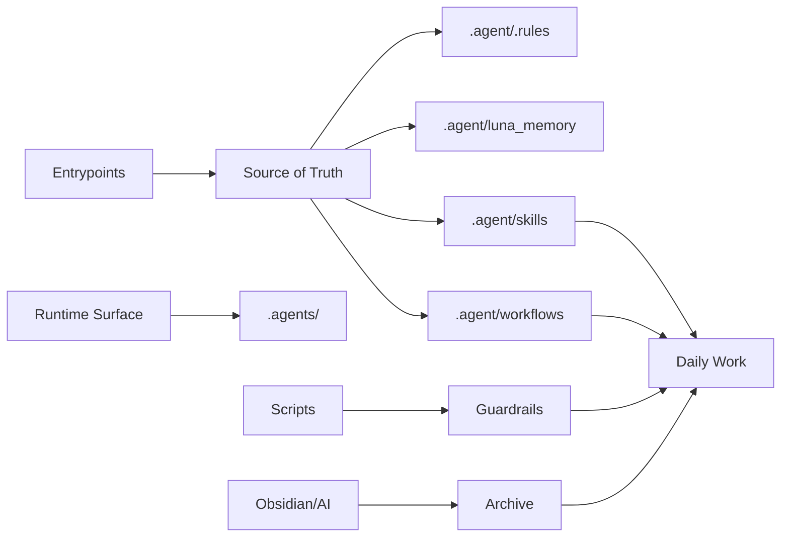
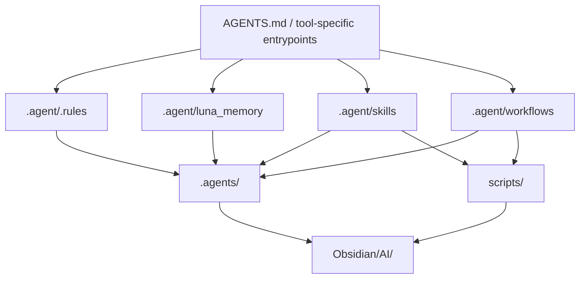
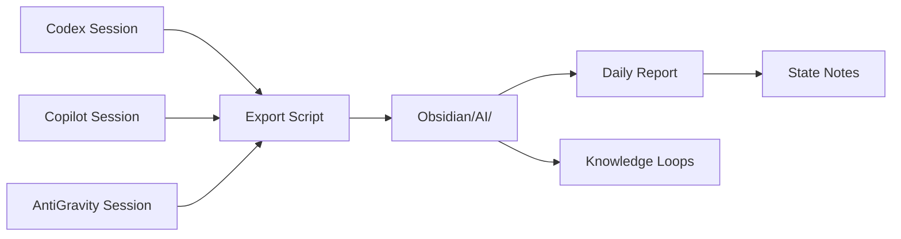

# Operating Model

この展示では、AI 実務運用を 7 つのレイヤーに分けて説明します。大事なのは、全部を 1 つの巨大な設定ファイルに押し込めないことです。

## 1. Entrypoints

`AGENTS.md` やモデル別 instructions は、長文の本文を抱え込む場所ではなく、**最初にどこを読ませるかを決める薄い入口** として使います。

入口に残すのは、主に次の情報です。

- 返答言語
- 立ち上がり方
- silent sync の有無
- どの正本を先に読むか
- 絶対に外してはいけない禁止事項

## 2. Source of Truth

運用ルール、長文メモ、記憶、ワークフロー本文は、入口ではなく **正本レイヤー** に置きます。

この分離には次の利点があります。

- 入口を薄く保てる
- 本文の更新箇所が明確になる
- モデルごとの入口が増えても重複が広がりにくい
- guardrail で `正本を参照しているか` を検査しやすい

この repo では、source-of-truth をさらに細かく分けています。

- `.agent/.rules`
  - 回答方針、安全、役割分担
- `.agent/luna_memory`
  - エージェント運用に必要な長文メモリ層
- `.agent/skills`
  - Skill 本文の正本
- `.agent/workflows`
  - 日報、state 同期、レーン分離などの定型手順

showcase では private な本文を除きつつ、**この責務分離そのもの** を見せる方針です。



## Source of Truth と Runtime Surface の分離

抽象論で終わらせないために、この repo では `どこが正本で、どこが実行時の露出面か` を明確に分けています。



| 層 | この repo での扱い |
| --- | --- |
| `AGENTS.md / tool-specific entrypoints` | どの正本を先に読むかを決める薄い入口 |
| `.agent/.rules` | 回答方針、安全、役割分担の正本 |
| `.agent/luna_memory` | 長文メモリや state stack の正本 |
| `.agent/skills` | 自作 Skill と wrapper の本文正本 |
| `.agent/workflows` | 日報、state 同期、レーン分離などの手順正本 |
| `.agents/` | Codex 系で露出が必要な runtime surface。正本の複製置き場ではない |
| `scripts/` | guardrail や素材収集の実行レイヤー |
| `Obsidian/AI/` | 会話や判断の根拠を戻り先として残す archive |

この分離をしておくと、`入口が肥大化する問題` と `runtime surface が正本化する問題` を同時に避けやすくなります。

## 3. Skills

Skill は、繰り返し使う作業を薄く定型化するためのレイヤーです。ここでは 2 種類に分けます。

- `repo-specific skill`: その workspace で反復している作業向け
- `generic skill`: 他の場所でも再利用しやすい汎用 skill

Skill はルール本文の置き場ではなく、**作業のショートカット** として扱います。

この repo では、実際に次のような自作 Skill を使っています。

- `luna-bootstrap-auditor`
  - 入口の読み順や state stack の責務分離を監査する
- `codex-runtime-tuner`
  - runtime config、permissions、PowerShell 周辺を扱う
- `home-automation-planner`
  - home 側 automation と archive 連携の設計を扱う
- `workspace-mothership-organizer`
  - workspace 全体の分類設計や整理を扱う
- `site-migration-debugger`
  - 特定案件に閉じたデバッグ手順を扱う

一方で、`obsidian-markdown` `obsidian-cli` `windows-automation-expert` のような generic skill も併用しています。つまり、**自作 Skill と汎用 Skill を混在させながら、正本とラッパーを分けて運用する** 形です。

## 4. Workflows

Workflow は、日報、状態同期、レーン分離のような **繰り返し手順の型** を持つためのレイヤーです。

ここで重要なのは、workflow を全部 automation にしないことです。人が主導して更新する層と、automation が補助する層を分けます。

この repo では、実際に次のような workflow を持っています。

- `current-state-sync.md`
- `daily-report.md`
- `session-lanes.md`
- `obsidian-operation-lanes.md`
- `debug.md`

showcase では、これらを全部並べるのではなく、`state 同期` `日報生成` `調査レーン分離` の 3 本柱として読みやすくまとめています。

## 5. State Stack

長い運用では、`今どこにいるか` と `どういう流れで今に来たか` を別に持つと再開しやすくなります。

この展示では次の考え方を採用しています。

- `Current State`: 今の作業状況と次の一手
- `Recent Context`: 最近の流れの圧縮要約
- `Project State`: 継続案件の phase や blocker

state note は長文ログではなく、**鮮度付きキャッシュ** として保つのが前提です。

## 6. Archive

AI との会話は、その場で終わると後から再利用しにくくなります。そこで、会話や作業ログを Markdown などの読み返しやすい形で archive します。

archive は live context の代わりではなく、次の役目を持ちます。

- 日報や引き継ぎの根拠になる
- 以前の判断を後追いできる
- 複数の AI を使い分けても履歴を 1 つの層で見返せる

また、この repo では archive を `正本` にせず、**必要時に戻る根拠層** として分離しています。日報、state note、workflow は archive を参照しますが、archive そのものが live state の代わりになるわけではありません。

## 7. Guardrails

入口、state、archive、tmp、hook のような壊れやすい場所は、都度人手で確認するより **小さな検査スクリプト** に寄せたほうが安定します。

guardrail の役割は、実装そのものではなく次のような確認です。

- 必須ファイルが存在するか
- 入口が正本を参照しているか
- archive 系の capture layer が崩れていないか
- tmp や local settings に不整合がないか

この repo では `scripts/check-workspace-harness.ps1` がその集約入口で、`entrypoints` `archive harness` `state materials` `tmp hygiene` などをまとめて見ます。showcase の sample でも、この **一括点検の考え方** を残しています。

## 8. Knowledge Loops

AI との作業を重ねると、`同じ場所で詰まる` `過去に解決したことを再調査する` という問題が出てきます。これを防ぐのが knowledge loop レイヤーです。

セッション中に得られた確認済みの事実、失敗パターン、有効だった手順を、テーマ別に `.agent/knowledge_loops/` へ記録します。

```text
.agent/knowledge_loops/
  daily_report_flow/
    retrieval_failures.md   ← 失敗・取り違え・再発防止
    confirmed_facts.md      ← 確認済みの安定事実
    working_patterns.md     ← 実際に効いた運用の型
    proposal_notes.md       ← まだ提案止まりの案
  current_state_stack/
  workspace_harness/
  startup_protocol/
  docs_entrypoints/
```

重要なのは、**作業後だけ書かない** ことです。作業中に再発防止策が見えた時点でその場で記録します。また、archive と違い、knowledge loop は `後から戻る根拠` ではなく、**次回セッションへの前向きな引き継ぎ** として機能します。

| ファイル | 目的 |
| --- | --- |
| `retrieval_failures.md` | 失敗・取り違え・再発防止策 |
| `confirmed_facts.md` | 確認済みの安定事実 |
| `working_patterns.md` | 実際に効いた運用の型 |
| `proposal_notes.md` | まだ試行段階の提案 |

この分離をすると、日報や state note では扱いにくい `運用知識の蓄積` を、archive とは別の専用レイヤーで持てます。Obsidian への日報書き出しや状態同期と組み合わせると、**セッションをまたいで学習する AI 運用環境** を実現できます。

## 9. Obsidian Integration

この repo では、AI との会話ログや日報を **Obsidian Vault へ自動書き出し** する仕組みを持っています。単に「ログを保存する」だけでなく、次の用途を担います。

- `AI Archive` としての会話ログ保存（`Obsidian/AI/` 配下）
- 日報の Vault 内生成・管理
- state note の参照先としての一元化

書き出しは PowerShell スクリプトで自動化しており、Codex / Copilot / AntiGravity など複数ツールのセッションログを同じ構造で格納します。これにより、ツールが変わっても **振り返りの場所が 1 か所** に保てます。



## 運用フロー

日常運用では、各レイヤーは次の順で噛み合います。

1. 入口から AI を立ち上げる
2. 正本を読んで silent sync する
3. 必要に応じて skill や workflow を参照する
4. 会話や実装を進める
5. 状態を短く state note に反映する
6. ログや会話を archive に残す（Obsidian Vault へ自動書き出し）
7. guardrail で全体の崩れを点検する
8. 有用な発見や再発防止策を knowledge loop に記録する

この流れを取ると、AI は `単発の便利ツール` ではなく、**再開しやすく、使うほど賢くなる作業環境の一部** になります。
