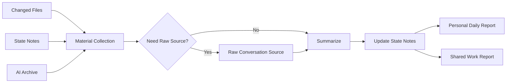

# Daily Report Workflow Sample

この sample は、AI archive や state note を参照しながら、日報と共有向け報告をまとめる workflow の例です。

ポイントは、`単に日報を生成する` ことではありません。実運用では、会話ログ・更新ファイル・state note・共有向け報告がバラバラだと、あとから作業の流れを追いにくくなります。そこで `archive -> state -> report` をつなぐ workflow として育てています。

## Goal

その日の作業を、会話ログや更新ファイルの根拠付きで振り返り、`自分用の日報` と `共有用の短い報告` を作ります。

## Flow

1. 対象日を決める
2. 会話ログ、更新ファイル、state note を収集する
3. 必要な時だけ raw source や AI archive に戻る
4. 当日の材料から state note の更新が必要か判断する
5. 自分用の日報を作る
6. 共有向け報告を作る
7. 実際に参照した archive だけ既読管理を更新する

## Inputs

- `Current State`
- `Recent Context`
- changed files
- AI archive
- 必要に応じて raw conversation source

## Operational Split

この workflow では、役割を次のように分けます。

| レイヤー | 役割 |
| --- | --- |
| Archive | 会話や判断の根拠を後から辿る |
| State | 今どこにいるか、何が次の一手かを短く持つ |
| Daily Report | 自分用に流れを再圧縮する |
| Shared Work Report | 内輪の温度や jargon を落として共有向けに変換する |

## Output Shape

### Personal Daily Report

- ハイライト
- 完了した作業
- 課題 / 次の一手
- 所感

### Shared Work Report

- 今日の作業
- 確認・調整したこと
- 次回に引き継ぐこと

共有向け報告では、private な会話温度や内部 jargon を外します。

## Rules

- archive はまず Markdown 側を参照する
- raw source は根拠が足りない時だけ見る
- state note は日報の代わりにしない
- 共有向け報告は業務語へ言い換える

## What We Learned In Practice

- 会話ログをそのまま日報化すると、長いのに再読しづらい
- 逆に、要約だけで済ませると判断の根拠が消えやすい
- shared report に内部用語が混ざると、外向けに読みにくくなる
- state note を日報の代わりに使うと、現在地キャッシュが肥大化する

そのため、`archive は根拠`、`state は現在地`、`report は再圧縮された成果物` と役割を分けるのが安定します。

## Why This Shape

日報生成を単なる文章整形で終わらせず、`archive -> state -> report` の流れにすると、作業の履歴と引き継ぎがつながりやすくなります。実運用では、この分離があることで `今日何をしたか` と `次に何を見るべきか` を混同しにくくなります。

## Related Material

- [../archive_to_report_flow.md](../archive_to_report_flow.md): `archive -> state -> report -> handoff` の接続例
- [./current_state.sample.md](./current_state.sample.md): state note 側の最小例
- [./automation_matrix.sample.md](./automation_matrix.sample.md): automation の責務分離
